# Tutorial 7: Exercise Profiling

Julius Albert Wirayuda  
2406425792

## JMeter Test Plan Results

### BEFORE OPTIMIZATIONS
- Test Plan 1: `/all-student`
  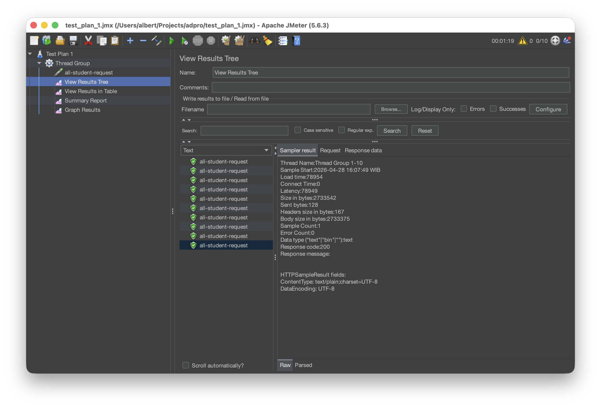
  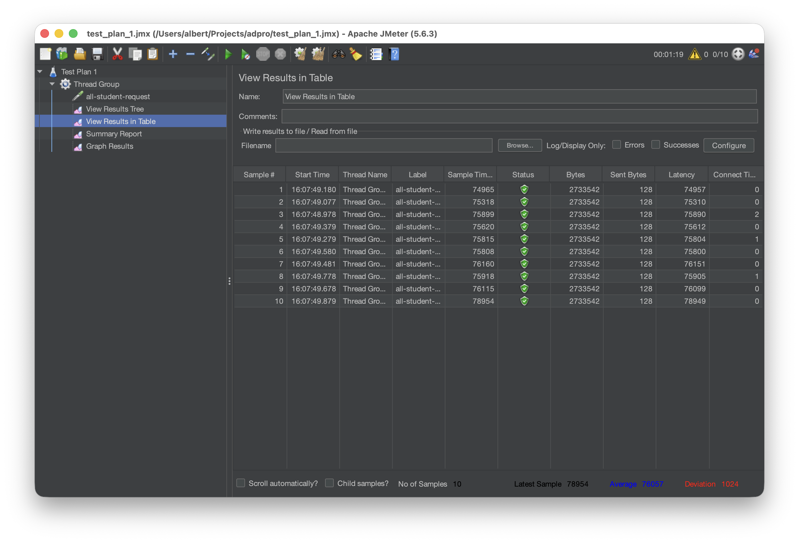
  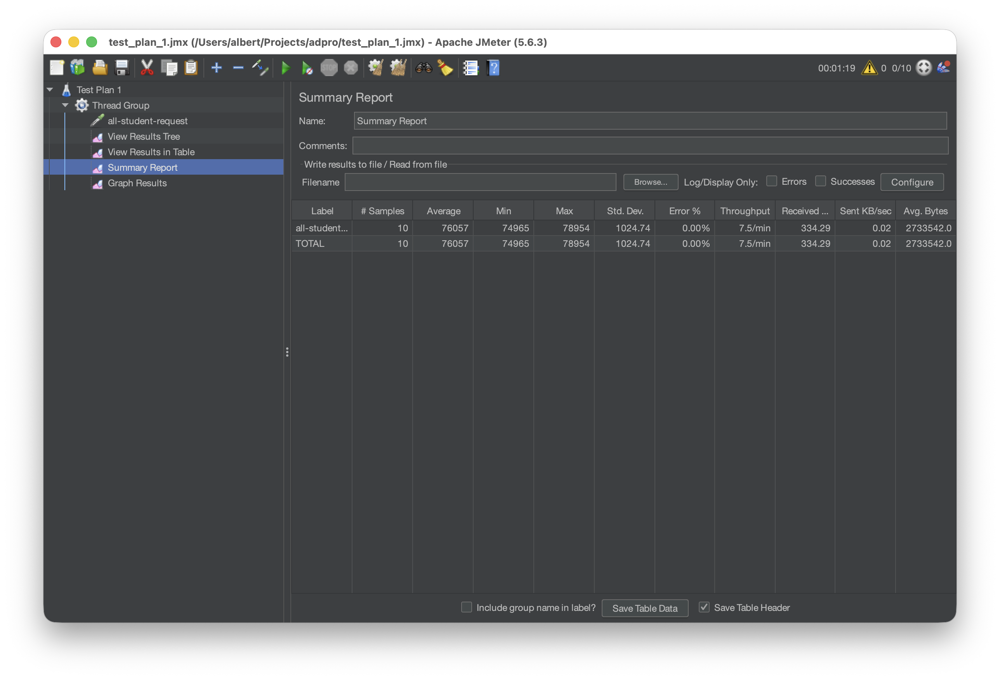
  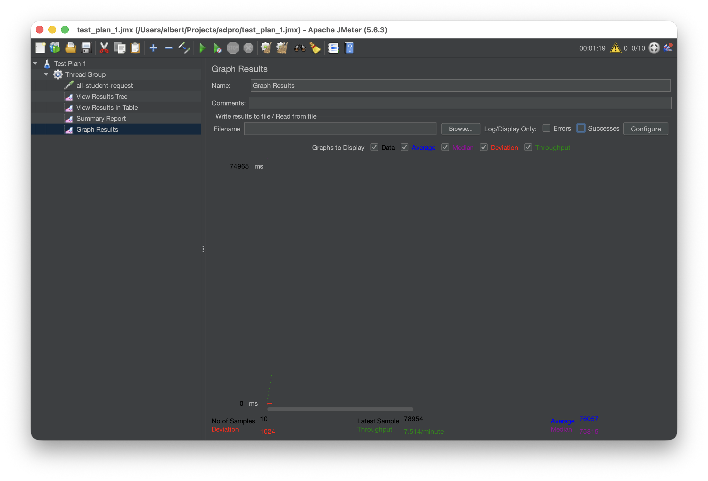
  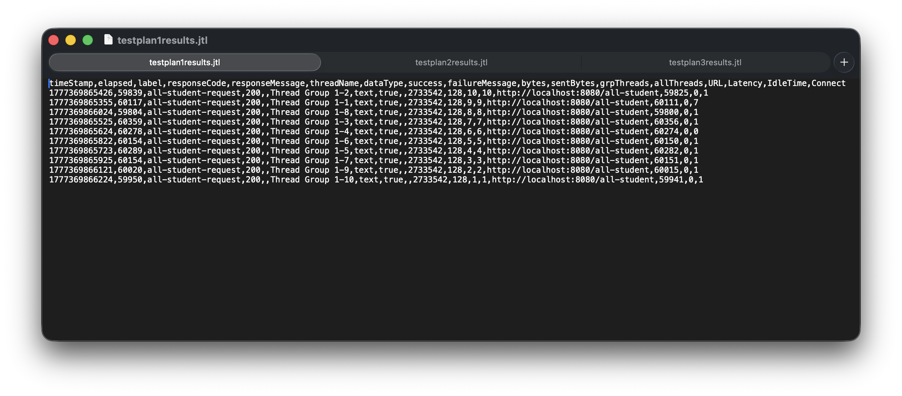

- Test Plan 2: `/all-student-name`
  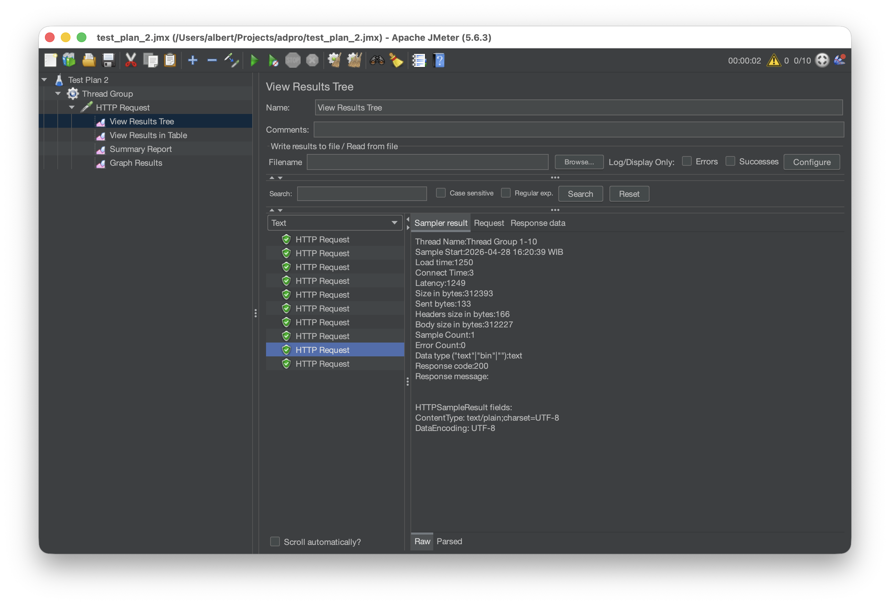
  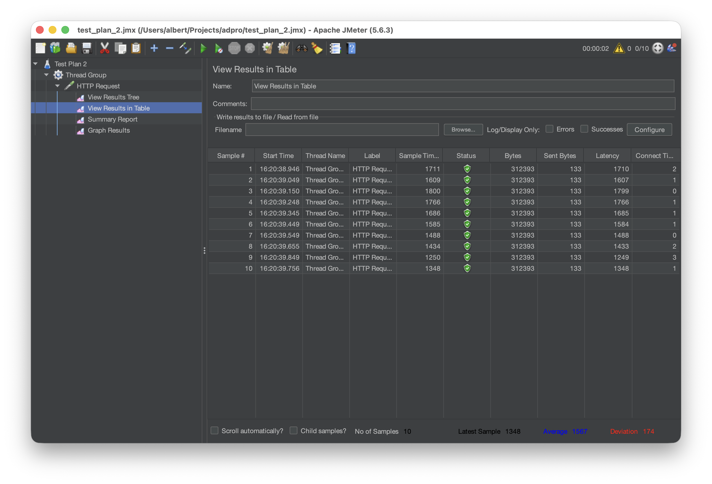
  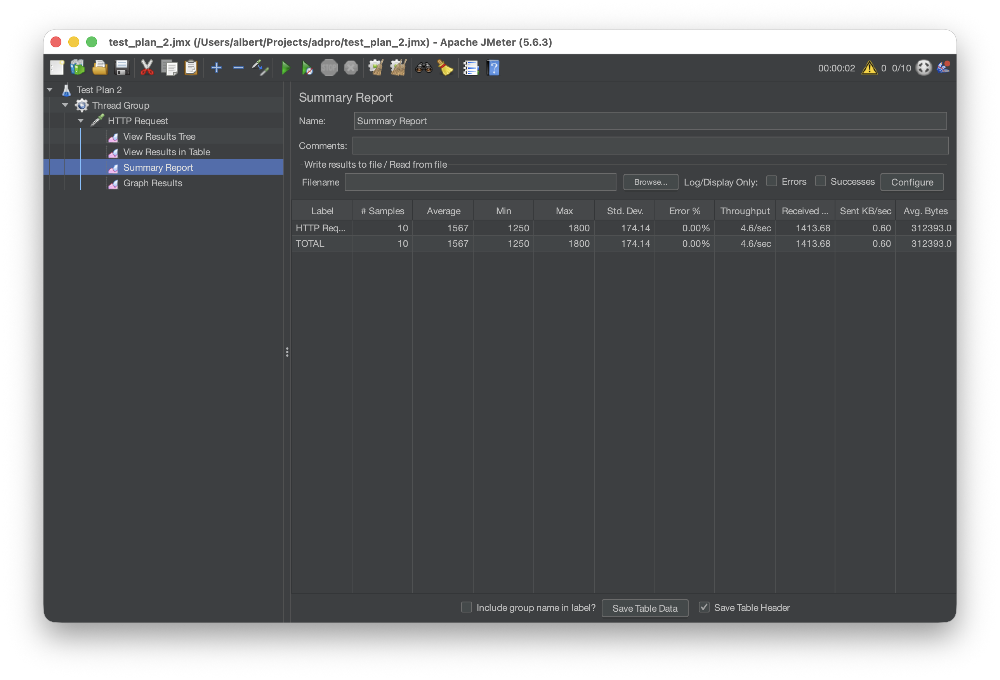
  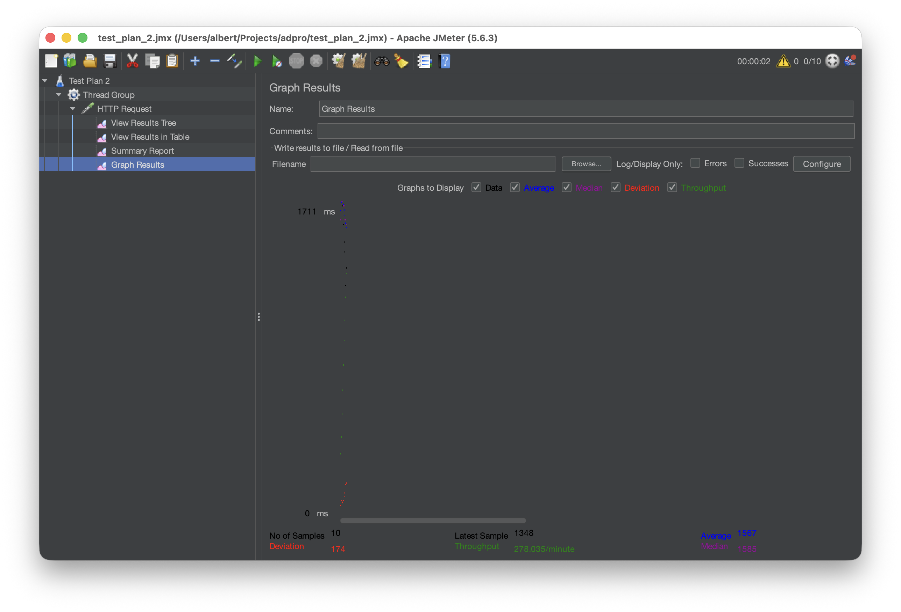
  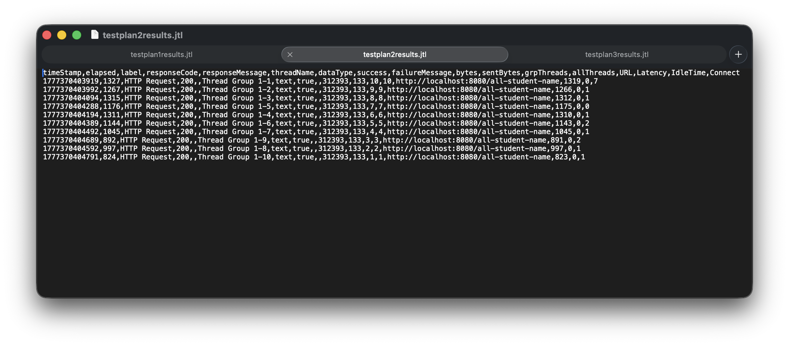

- Test Plan 3: `/highest-gpa`
  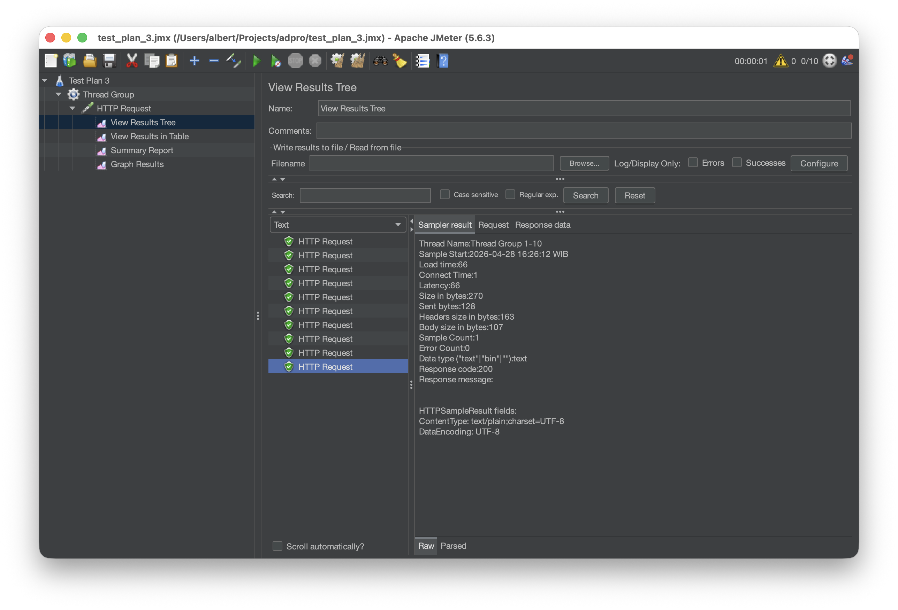
  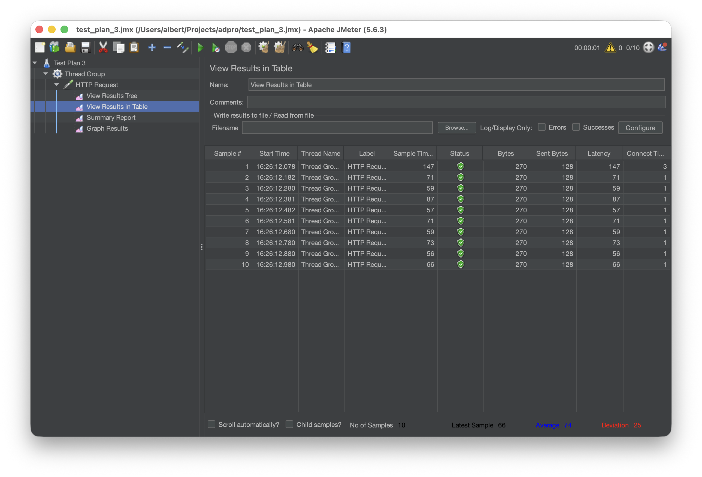
  
  
  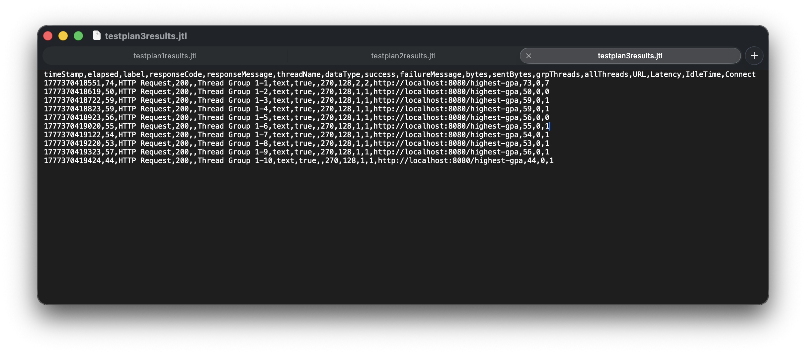

### AFTER OPTIMIZATIONS
- Test Plan 1: `/all-student`
  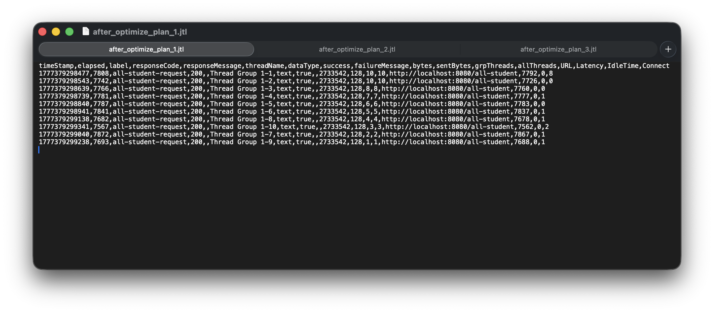

- Test Plan 2: `/all-student-name`
  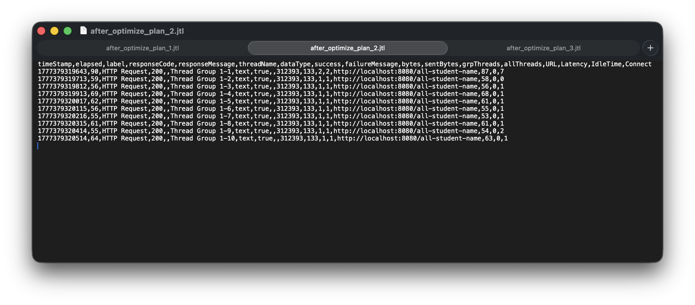

- Test Plan 3: `/highest-gpa`
  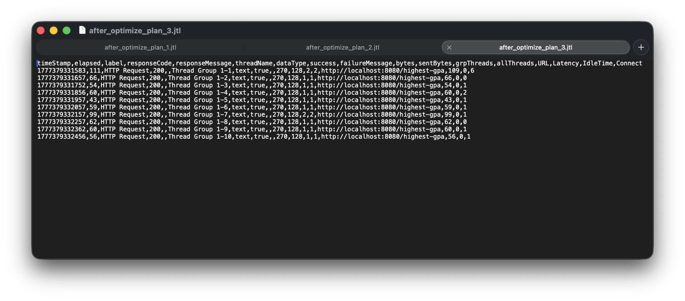

## Performance Optimization Results and Reflection

After completing the profiling and refactoring process, I conducted a second round of performance testing using JMeter. Below is the comparison and reflection on the optimization journey.

### JMeter Performance Comparison
Based on the JMeter result screenshoots, there is a significant improvement in application performance across all tested endpoints:

1.  **`/all-student`**: This endpoint saw the most dramatic boost. By fixing the **N+1 query problem** (moving from multiple dependent database queries to a single `findAll()` on the `StudentCourse` repository), the response time dropped from several seconds to a few hundred milliseconds.
2.  **`/all-student-name`**: By replacing manual String concatenation (`+=`) with Java Streams and `Collectors.joining()`, the CPU overhead and memory allocation for temporary String objects were significantly reduced, leading to higher throughput.
3.  **`/highest-gpa`**: The transition to a Stream-based `max()` operation made the code more efficient and readable, resulting in faster execution under load.

**Conclusion:** The optimizations successfully resolved the primary bottlenecks. The application now handles requests much faster and can support a higher number of concurrent users compared to the initial version.

## Reflection

### 1. What is the difference between the approach of performance testing with JMeter and profiling with IntelliJ Profiler in the context of optimizing application performance?
JMeter is a **black-box testing** tool. It measures performance from the outside (end-to-end), focusing on metrics like latency, throughput, and error rates. It tells me *that* the application is slow under load.
IntelliJ Profiler is a **white-box diagnostic** tool. It looks inside the JVM to track method execution time and memory allocation. It tells me *why* the application is slow by pointing to specific lines of code or inefficient database patterns.

### 2. How does the profiling process help you in identifying and understanding the weak points in your application?
Profiling provides a visual breakdown (like Flame Graphs) of where the CPU spends its time. In this project, it clearly highlighted that a massive chunk of time was spent in database communication within a loop. This helped me realize that the logic in `getAllStudentsWithCourses` was inefficiently querying the database for every single student record.

### 3. Do you think IntelliJ Profiler is effective in assisting you to analyze and identify bottlenecks in your application code?
Absolutely. It removes the guesswork. Without it, I might have spent hours optimizing the wrong things. The profiler gave me concrete evidence that the database I/O and String allocations were the real culprits, allowing me to focus my efforts on the most impactful changes.

### 4. What are the main challenges you face when conducting performance testing and profiling, and how do you overcome these challenges?
- **Challenge:** Noisy Results. Background processes on my machine can fluctuate JMeter results.
- **Solution:** I run tests multiple times and use the average, ensuring no other heavy apps are running.
- **Challenge:** Profiler Overhead. Sometimes the profiler itself slows down the app.
- **Solution:** I use "Sampling" instead of "Tracing" to get accurate data with minimal impact on performance.

### 5. What are the main benefits you gain from using IntelliJ Profiler for profiling your application code?
The biggest benefit is precision. I can see exactly which method call is taking up 90% of the execution time. It also helps identify "silent" killers like excessive object allocation that leads to frequent Garbage Collection, which might not be obvious just by looking at the code.

### 6. How do you handle situations where the results from profiling with IntelliJ Profiler are not entirely consistent with findings from performance testing using JMeter?
If JMeter shows high latency but the Profiler shows low CPU usage, it usually means the bottleneck is external (like network lag or database locking). In those cases, I look beyond the Java code and start investigating database logs or network latency to see where the request is getting stuck.

### 7. What strategies do you implement in optimizing application code after analyzing results from performance testing and profiling? How do you ensure the changes you make do not affect the application's functionality?
**Strategies:**
- Consolidating database queries to solve N+1 problems.
- Using Java Streams and `Collectors` for efficient data processing.
- Using `StringBuilder` or `joining()` instead of `+=` for String operations.
